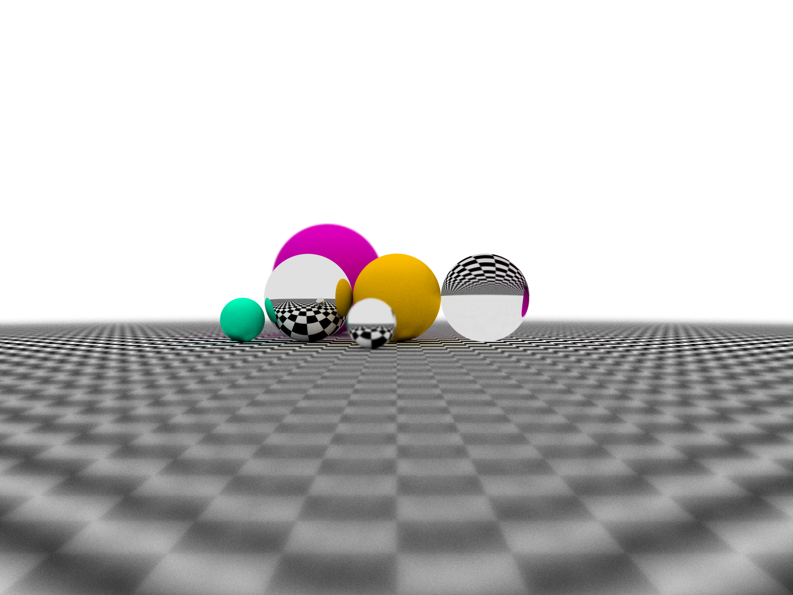

# ray_tracing
This is used to review my C++ skills, so this is just a toy model.

The following features ARE implemented:
-- Sphere object  
-- Antialiasing  
-- Diffuse Materials  
-- Reflect Materials  
-- Refract Materials  
-- Positionable camera  
-- Depth of field  

To create picture quicker, decrease **DEFAULT_ANTI** and **MAX_DEPTH** global variables in *world.cpp*(though it will decrease quality of the picture)

